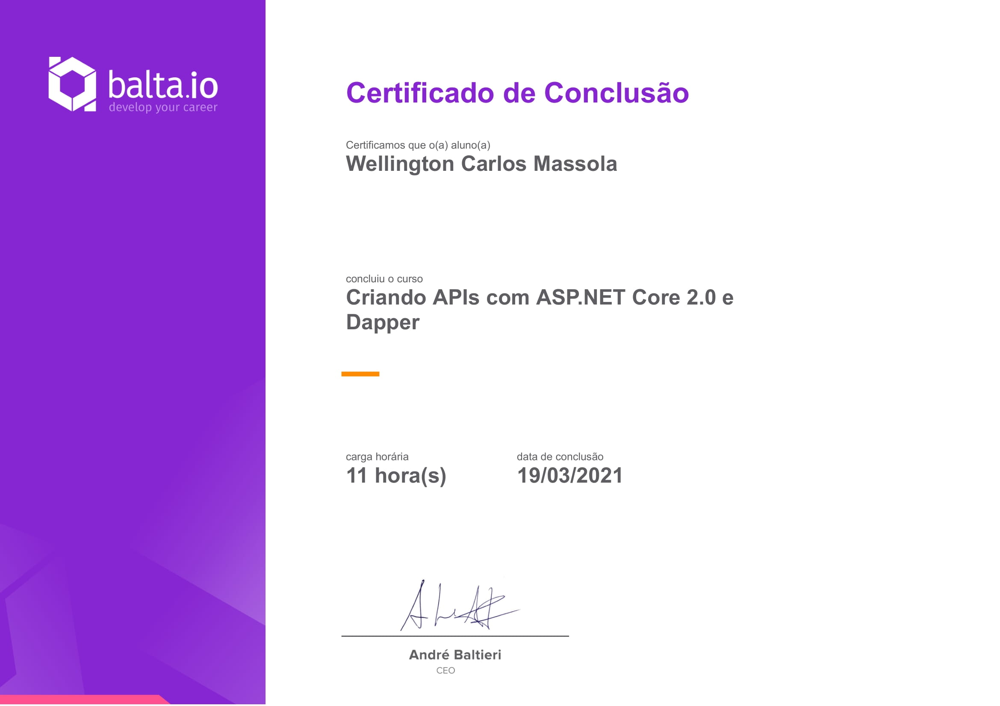

# Curso [balta.io 1974](https://balta.io/cursos/criando-apis-com-aspnetcore-2-e-dapper)

Curso Backend C#.  

Link do curso: [https://balta.io/cursos/criando-apis-com-aspnetcore-2-e-dapper](https://balta.io/cursos/criando-apis-com-aspnetcore-2-e-dapper)

Tecnologias:  
 

## Criando APIs com ASP.NET Core 2.0 e Dapper

Neste curso vamos aprender a criar uma API completa utilizando a mais nova versão do .NET Core e ASP.NET Core.

## Instrutor

André Baltieri - 8x Microsoft MVP

## Progresso do curso

- [x] Introdução
- [x] Instalação e Ferramentas
- [x] .NET Framework, .NET Core, .NET Standard
- [x] Organizando a Solução
- [x] Domínios Ricos vs Domínios Anêmicos
- [x] Sub Domínios
- [x] Separação em Contextos Delimitados
- [x] OOP: Classes
- [x] OOP: Modificadores
- [x] OOP: Sealed/Abstract
- [x] OOP: Interfaces e Sobrescrita
- [x] Definindo as Entidades
- [x] Corrupção no Código
- [x] Ajustando as Entidades
- [x] Value Objects
- [x] Collections
- [x] Modelando o Pedido
- [x] Simulando o Pedido
- [x] Exceptions e Validações
- [x] Implementando Notificações
- [x] Compartilhando Informações entre Contextos Delimitados
- [x] Criando pacotes com NuGet
- [x] Testando VOs
- [x] Testando Entidades
- [x] CQRS
- [x] Commands
- [x] Criando o primeiro Command
- [x] Criando os demais Commands
- [x] Fail Fast Validations
- [x] Aplicando Validações
- [x] Testando os Commands
- [x] Handlers
- [x] Criando um Handler
- [x] Repositórios
- [x] Serviços
- [x] Injeção de Dependência
- [x] Mocks e Fakes
- [x] Testando os Handlers
- [x] Criando o Banco de Dados
- [x] Criando as Stored Procedures
- [x] Criando o Data Context
- [x] Criando o Repositório
- [x] Criando as Queries
- [x] Iniciando o projeto Web
- [x] Adicionando MVC
- [x] Criando um Controller
- [x] Padrão REST
- [x] CRUD
- [x] Testando os CRUD
- [x] Injeção de Dependência
- [x] Utilizando os Repositórios
- [x] Utilizando os Handlers
- [x] Versionando a API
- [x] Cache
- [x] Compressão
- [x] Padronização
- [x] Documentando a API com Swagger
- [x] Utilizando ELMAH para log de erros
- [x] Utilizando o AppSettings
- [x] Utilizando Application Insights
- [x] FINAL: Deploy da Aplicação na Nuvem

